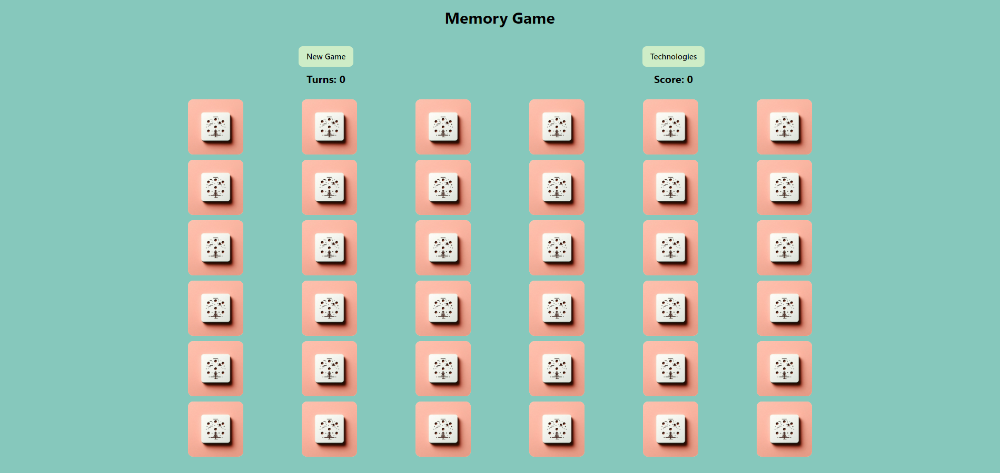
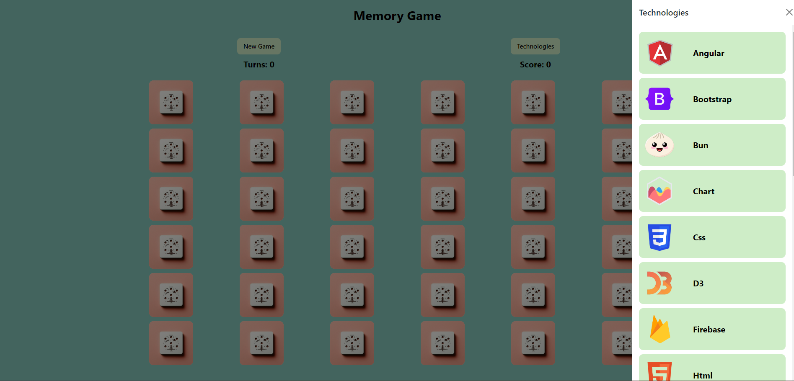
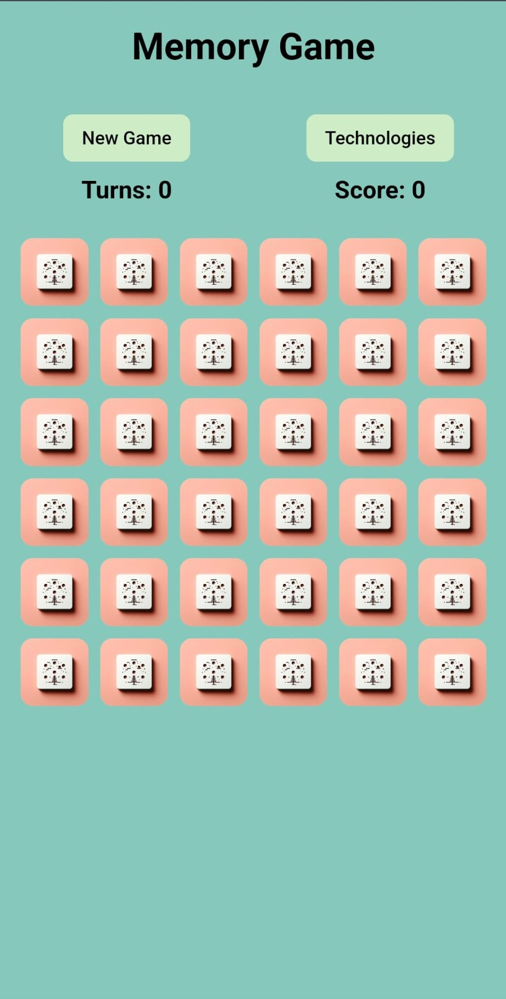
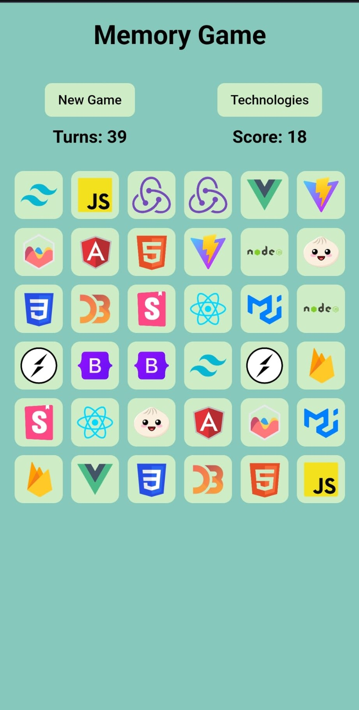
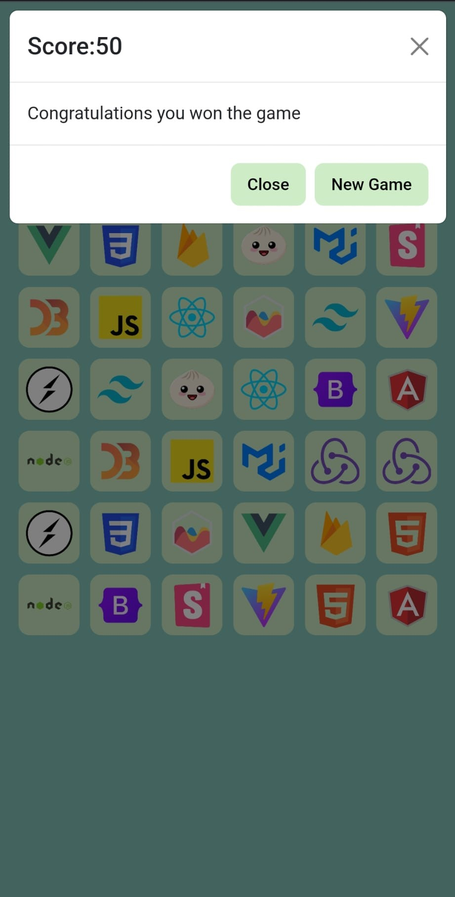

# React Memory Game

This project is a fun memory game for software engineers.

### Technologies Used

- **React + Vite:** A modern and fast development environment.
- **Styled-components:** Component-based styling.
- **Bootstrap:** A CSS framework for responsive and quick design.

## Screenshots
### Desktop View

### Mobile View

