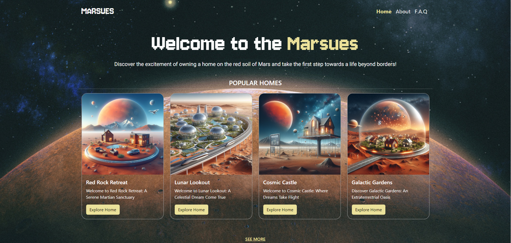

# MARSUES

Bu proje, Mars'ta yerleşik evlerin satışını yapmak için bir web sitesi oluşturmayı amaçlamaktadır.

## Kurulum

1. Bu depoyu yerel makinenize klonlayın.
2. Gerekli bağımlılıkları yüklemek için `npm install` komutunu çalıştırın.
4. Uygulamayı başlatmak için anasayfa üzerinde sağ tıklayarak `Open with live server` komutunu çalıştırın.

## Kullanım

1. Web tarayıcınızda `http://127.0.0.1:5500/pages/homepage.html` adresine gidin.
2. Ana sayfada mevcut evlerin listesini görüntüleyin.
3. İlgilendiğiniz evlere tıklayarak ayrıntıları ve resimleri görüntüleyin.
4. Ev satın almak için iletişim bilgileri aracılığıyla satıcı ile iletişime geçin.

## Teknolojiler

- HTML
- CSS
- SCSS
- BOOTSTRAP

## Örnek Ekran Görüntüleri

_Anasayfa_

_Evin Detayları_

## Katılım

Eğer projeye katkıda bulunmak isterseniz, lütfen forklayın ve pull request gönderin. Ayrıca sorunları bildirebilirsiniz.

## Lisans

Bu proje ISC lisansı altında lisanslanmıştır. Daha fazla bilgi için LICENSE dosyasına göz atın.

## Yazar

- Alpay Özer <alpayozer7@gmail.com>

## Bağlantılar

- [GitHub Repository](https://github.com/waroi/TurkcellFrontend2024/tree/main/Ogrenciler/alpayozer/Odevler/Vize-1)

## Sorunlar ve İletişim

Projeyle ilgili herhangi bir sorunuzu veya geri bildiriminizi GitHub üzerinden iletebilirsiniz.
